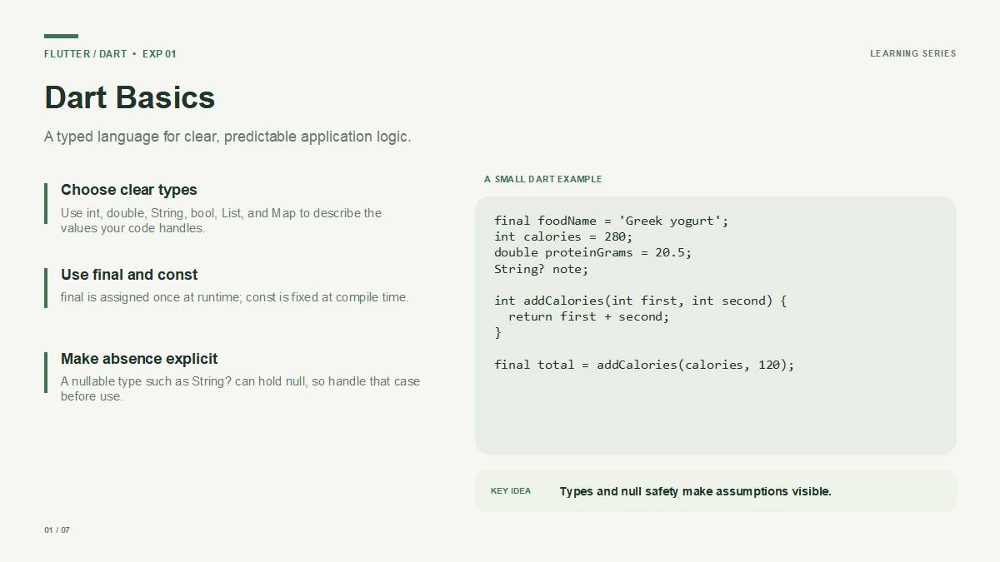
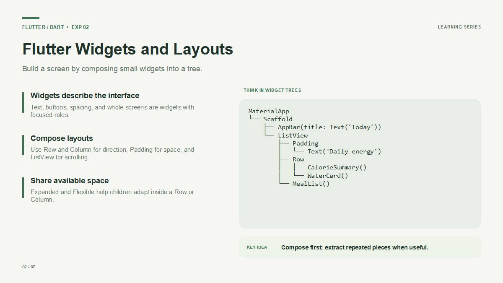
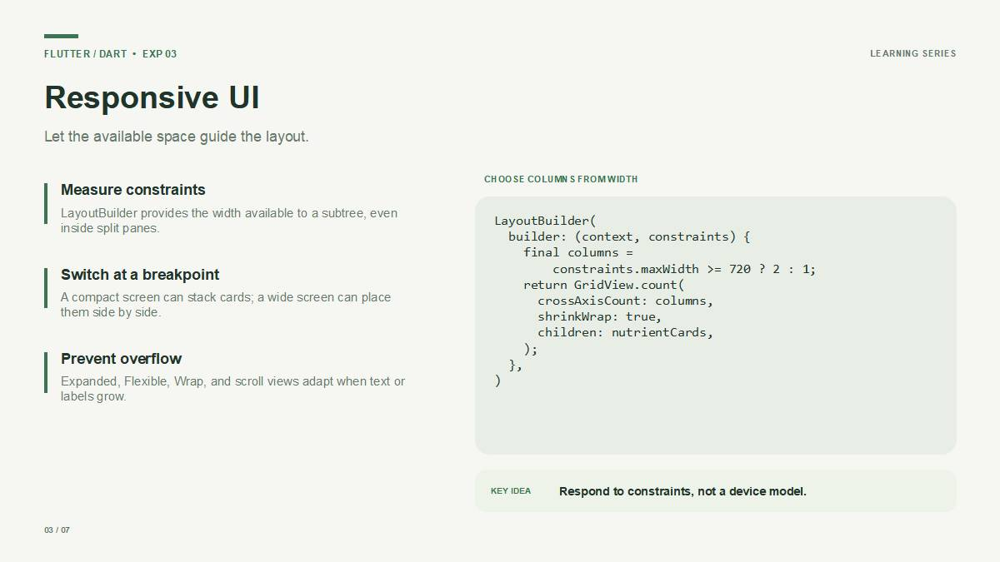
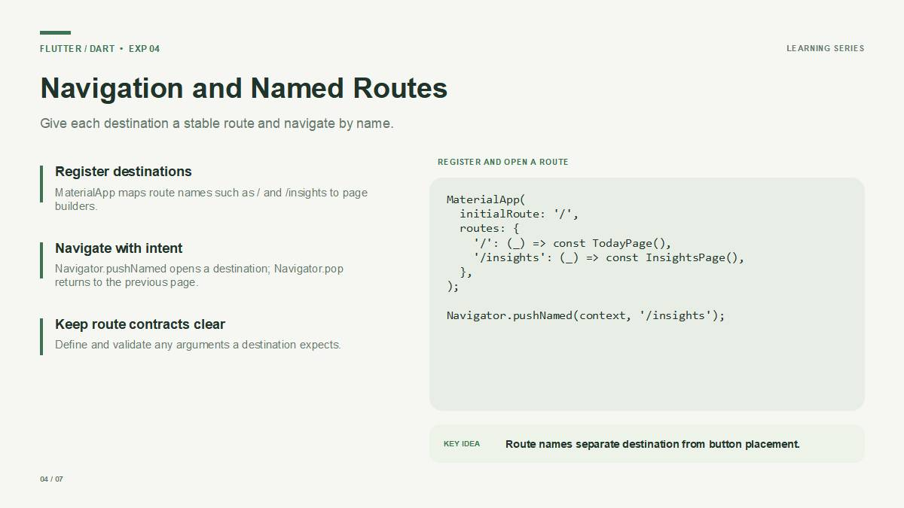
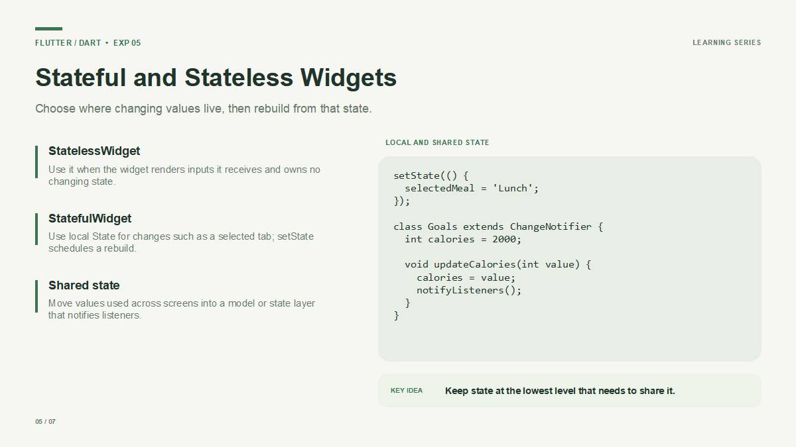
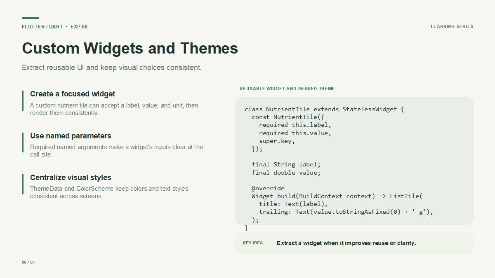
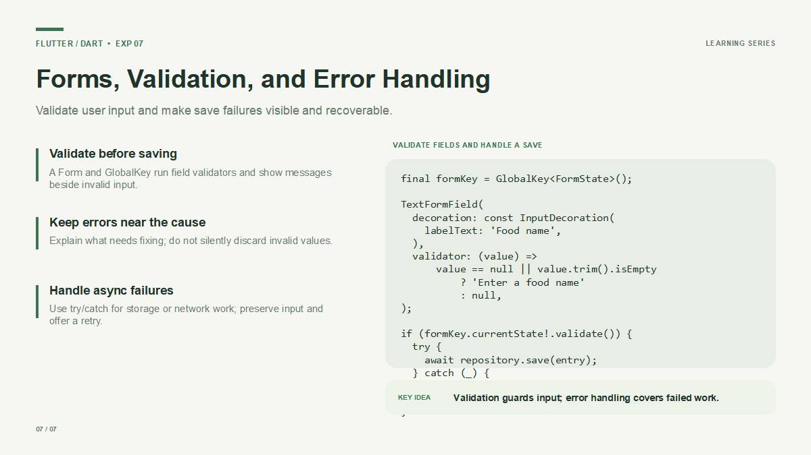

# NutriDay

**Built with Flutter. App source is written in Dart.**

NutriDay is a cross-platform nutrient tracker. The Flutter app records meals, calories, nutrients, hydration, and daily goals, then saves each day's data locally on the device.

> The old browser app has been removed. The Flutter entry point is `lib/main.dart`; there are no JavaScript, CSS, or HTML app source files. GitHub identifies programming languages, so its language label will say **Dart**. Flutter is the framework shown above.

## Run the app

1. Install the Flutter SDK.
2. From the repository root, generate runner files for the platform you want to use. For Android and iOS, run `flutter create --platforms=android,ios .`.
3. Fetch packages with `flutter pub get`.
4. Start the app with `flutter run`.

Flutter generates platform runner files for the selected target. The app interface and behavior remain in Dart under `lib/`.

## App features

- Log food under breakfast, lunch, dinner, or snacks.
- Track calories, protein, carbohydrates, fat, fiber, and water.
- Navigate between dates; meals and water are stored per day.
- Set personal nutrient goals and view progress in Insights.
- Save the tracker locally with `shared_preferences`.
- Start with a sample meal log on first launch.

## Flutter learning slides

The seven slide lessons below follow the matching experiments in order. Each section includes the slide's explanation, key idea, and Dart code example. All examples are Dart.

### EXP 1 — Dart Basics



Dart is the programming language used to write Flutter apps. Types describe values your code handles: `int`, `double`, `String`, `bool`, `List`, and `Map`. Use `final` for a value assigned once at runtime and `const` for a compile-time constant. A nullable type such as `String?` can hold `null`, so check for absence before using it.

**Slide code — values, null safety, and a function:**

```dart
final foodName = 'Greek yogurt';
int calories = 280;
double proteinGrams = 20.5;
String? note;

int addCalories(int first, int second) {
  return first + second;
}

final total = addCalories(calories, 120);
```

**Key idea:** Types and null safety make assumptions visible.

### EXP 2 — Flutter Widgets and Layouts



Flutter builds a screen by composing small widgets into a tree. `Text`, buttons, spacing, and entire screens are widgets with focused roles. Use `Row` and `Column` for layout direction, `Padding` for space, and `ListView` for scrolling. `Expanded` and `Flexible` help children share the available room.

**Slide widget tree:**

```text
MaterialApp
└── Scaffold
    ├── AppBar(title: Text('Today'))
    └── ListView
        ├── Padding
        │   └── Text('Daily energy')
        ├── Row
        │   ├── CalorieSummary()
        │   └── WaterCard()
        └── MealList()
```

**Equivalent Dart layout:**

```dart
Scaffold(
  appBar: AppBar(title: const Text('Today')),
  body: ListView(
    children: [
      const Padding(
        padding: EdgeInsets.all(16),
        child: Text('Daily energy'),
      ),
      const Row(
        children: [
          Expanded(child: CalorieSummary()),
          Expanded(child: WaterCard()),
        ],
      ),
      const MealList(),
    ],
  ),
)
```

**Key idea:** Compose widgets first; extract repeated pieces when useful.

### EXP 3 — Responsive UI



Responsive layouts use the available space to decide how content should appear. `LayoutBuilder` provides the width available to a subtree, including inside split panes. A compact screen can stack cards, while a wider screen can show them in columns. Use `Expanded`, `Flexible`, `Wrap`, and scroll views to prevent overflow when text or labels grow.

**Slide code — choose the grid columns from width:**

```dart
LayoutBuilder(
  builder: (context, constraints) {
    final columns = constraints.maxWidth >= 720 ? 2 : 1;

    return GridView.count(
      crossAxisCount: columns,
      shrinkWrap: true,
      children: nutrientCards,
    );
  },
)
```

**Key idea:** Respond to constraints, not a device model.

### EXP 4 — Navigation and Named Routes



Named routes give each destination a stable name. `MaterialApp` maps route names such as `/` and `/insights` to page builders. `Navigator.pushNamed` opens a destination, and `Navigator.pop` returns to the previous page. Define and validate any arguments that a destination expects.

**Slide code — register routes and navigate:**

```dart
MaterialApp(
  initialRoute: '/',
  routes: {
    '/': (_) => const TodayPage(),
    '/insights': (_) => const InsightsPage(),
  },
);

// Open the Insights page from a button callback:
Navigator.pushNamed(context, '/insights');
```

**Key idea:** Route names separate a destination from the button that opens it.

### EXP 5 — Stateful and Stateless Widgets + State Management



Use a `StatelessWidget` when a widget renders the inputs it receives and owns no changing state. A `StatefulWidget` can hold local state, such as a selected tab; calling `setState` schedules a rebuild. Move values used across screens into a shared model or state layer that notifies listeners.

**Slide code — local and shared state:**

```dart
setState(() {
  selectedMeal = 'Lunch';
});

class Goals extends ChangeNotifier {
  int calories = 2000;

  void updateCalories(int value) {
    calories = value;
    notifyListeners();
  }
}
```

**Key idea:** Keep state at the lowest level that needs to share it.

### EXP 6 — Custom Widgets and Themes



Extract a custom widget when it makes repeated interface elements clearer or reusable. Named parameters make its inputs clear at the call site. Use `ThemeData` and `ColorScheme` to keep colors and text styles consistent across screens.

**Slide code — reusable nutrient widget:**

```dart
class NutrientTile extends StatelessWidget {
  const NutrientTile({
    required this.label,
    required this.value,
    super.key,
  });

  final String label;
  final double value;

  @override
  Widget build(BuildContext context) => ListTile(
        title: Text(label),
        trailing: Text('${value.toStringAsFixed(0)} g'),
      );
}
```

**Key idea:** Extract a widget when it improves reuse or clarity.

### EXP 7 — Forms, Validation, and Error Handling



Use a `Form` and `GlobalKey<FormState>` to validate input before saving. Field validators should explain what needs fixing, with the message next to the invalid field. Saving data is asynchronous work: use `try`/`catch` for storage or network failures, keep the user's input visible, and offer a retry.

**Slide code — validate a field and handle a failed save:**

```dart
final formKey = GlobalKey<FormState>();

TextFormField(
  decoration: const InputDecoration(
    labelText: 'Food name',
  ),
  validator: (value) =>
      value == null || value.trim().isEmpty
          ? 'Enter a food name'
          : null,
);

if (formKey.currentState!.validate()) {
  try {
    await repository.save(entry);
  } catch (_) {
    showError('Could not save. Try again.');
  }
}
```

**Key idea:** Validation guards input; error handling covers failed work.

## Project files

- `lib/main.dart` — Flutter app entry point, screens, and local state.
- `pubspec.yaml` — Flutter package metadata and Dart dependencies.
- `docs/FLUTTER_CONCEPTS.md` — implementation notes and links to these lessons.

The repository's application code is Flutter/Dart. Markdown and YAML files provide documentation and Flutter project configuration.
